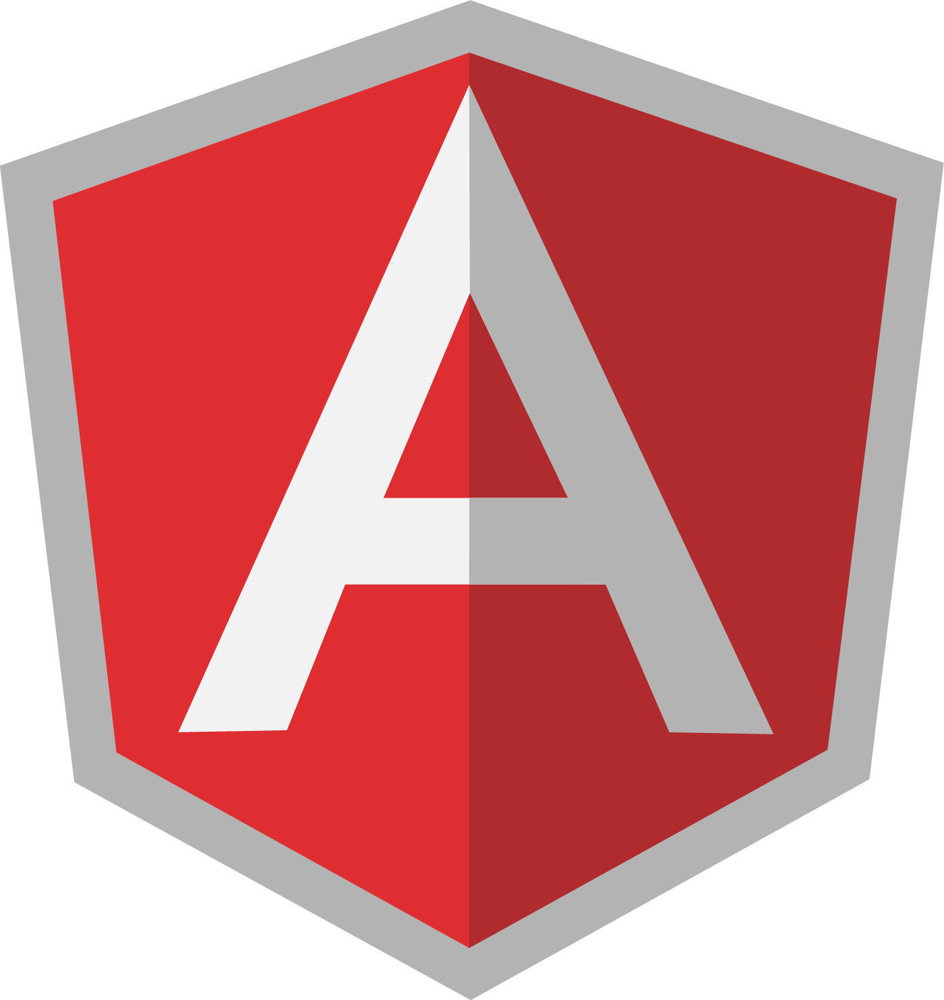

# Fullstack Task Manager

---

## Package Manager

**NPM** is the package manager used in this project and we recommend you using it aswell. Most or all of the **Nodejs** packages and cli will have support for this package manager out of the box, because it is the default **Nodejs** package manager.

## Stack

- NX
- Angular
- Nestjs
- Redis(Cache)
- FaunaDB
- Nodejs

## Programming Languages

- Javascript(JS)
- Typescript(TS)
- Fauna Query Language(FQL)

## Typescript Resources

- [Documentation](https://www.typescriptlang.org/docs/)
- [TS Cheat Sheets](https://www.typescriptlang.org/cheatsheets)
- [Decorators](https://www.typescriptlang.org/docs/handbook/decorators.html)

## Nx Resources

- [Documentation](https://nx.dev/getting-started/intro)

## Nestjs Resources

- [Documentation](https://docs.nestjs.com/)
- [Caching](https://docs.nestjs.com/techniques/caching)

## Redis Resources

- [Documentation](https://docs.redis.com/latest/)
- [Nestjs implementation](https://docs.nestjs.com/techniques/caching#different-stores)

## Fauna Resources

- [Documentation](https://docs.fauna.com/fauna/current)
- [FQL Cheat Sheet](https://docs.fauna.com/fauna/current/api/fql/cheat_sheet)

## Angular Resources

- [Documentation](https://angular.io/docs)
- [Angular Material](https://material.angular.io/)
